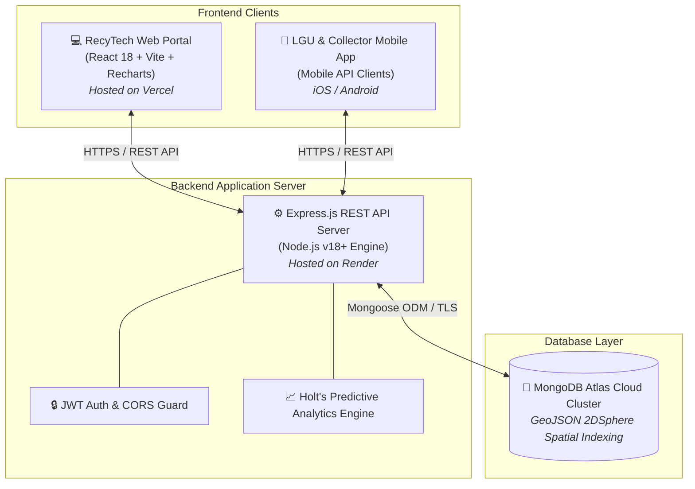

# 🏗️ RecyTech System Architecture

[](https://react.dev/)
[](https://nodejs.org/)
[](https://www.mongodb.com/atlas)
[](https://vercel.com)

A comprehensive architectural document detailing the system topology, technology stack, data flow, core modules, and predictive analytics engine for the **RecyTech Smart E-Waste Management Platform**.

---

## 📌 System Overview

**RecyTech** is a smart electronic waste (e-waste) collection, monitoring, and analytics platform. The web application functions as an administrative command center for:
- 📡 Monitoring smart bin networks and GIS spatial locations
- 🚚 Managing LGU collection requests and dispatching collectors
- 🎁 Awarding resident eco-points for drop-offs
- 📊 Predictive forecasting of drop-off volumes using **Holt's Double Exponential Smoothing**

---

## 📐 High-Level Topology & Flow



---

## 🛠️ Technology Stack

| Layer | Technology / Library | Purpose / Function |
| :--- | :--- | :--- |
| **Frontend Framework** | **React 18 + Vite** | Fast SPA UI rendering and module bundling |
| **Routing** | **React Router DOM v6** | Client-side page navigation & protected routes |
| **Data Visualization** | **Recharts** | Interactive trend lines & waste distribution pie charts |
| **GIS Mapping** | **Leaflet + OpenStreetMap** | Real-time smart bin geographic location mapping |
| **Export Engine** | **HTML2Canvas + jsPDF** | PDF report generation from browser DOM |
| **Icons & Styling** | **Lucide React + CSS Modules** | Modern design tokens and responsive layout |
| **Backend Runtime** | **Node.js (v18+) + Express** | High-performance RESTful API server |
| **Security** | **JWT + Bcryptjs + Dynamic CORS** | Token authentication and cross-origin security (`*.vercel.app`) |
| **Database** | **MongoDB Atlas + Mongoose v8** | Document NoSQL storage & GeoJSON spatial coordinates |

---

## 🧩 Core Platform Modules

### 1. 📊 Operations Dashboard
- Real-time KPI cards: *Total Recycled E-Waste (kg)*, *Urgent Bin Alerts*, *Pending Requests*, and *Operational Bins*.
- Actionable predictive prompts and snapshot forecasts.

### 2. 🗺️ Smart Bin Network (GIS GIS)
- Interactive map rendering bin coordinates using GeoJSON `2DSphere` indexing.
- Status lifecycle tracking (`Empty`, `Full`, `Maintenance`).
- Automated QR code string generation for drop-off verification.

### 3. 🚚 Collection Requests & Dispatch
- Monitored queue for manual & automated LGU pickup dispatches.
- Lifecycle tracking: `pending` → `scheduled` → `in-progress` → `completed`.
- Weight recording per category upon collector pickup completion.

### 4. 🏛️ LGU Jurisdiction Management
- Administration of Local Government Unit (LGU) accounts.
- Scopes smart bins and collection statistics by LGU jurisdiction.

### 5. 🎁 Reward Points & Drop-Off System
- Records resident e-waste drop-offs.
- Automatically calculates eco-reward points based on waste weight and category.
- Complete transaction log and history audit.

### 6. ⚙️ Account Settings & Profile Management
- Self-service profile updates (First Name, Last Name).
- Password security updates with interactive real-time strength validation.
- Custom system preferences (Live in-app alerts, audio chimes, default table page sizes).

---

## 📈 Predictive Analytics Engine

> [!NOTE]
> RecyTech uses **Holt's Double Exponential Smoothing** ($\alpha = 0.3, \beta = 0.2$) to model time-series drop-off behavior.

```
       Forecast Equation: Y_(t+h) = Level_t + h * Trend_t
```

- **Level & Trend Adaptation**: Separately tracks baseline volume and growth direction. Works accurately even with short historical datasets (3–6 months).
- **90% Confidence Intervals**: Computes forecast uncertainty bounds `[LowerBound, UpperBound]` using residual standard error scaling over forecast horizon $h$.
- **Anomaly Detection**: Uses IQR (Interquartile Range) to flag outlier months for operational review.

---

## 🔒 Security & Access Control

> [!IMPORTANT]
> All administrative endpoints enforce Role-Based Access Control (RBAC) via JWT Bearer Token verification.

| Role | Access Level |
| :--- | :--- |
| **Super Admin** | Full platform access including User Account Creation & System Administration |
| **Admin / Staff** | Operations Dashboard, Smart Bins, Collection Dispatches, LGUs, Reward Points, Analytics |
| **Collector / LGU** | Scoped Mobile API endpoints for request submissions and dispatch updates |

---

<p align="center">
  <sub>Built for RecyTech E-Waste Management &copy; 2026</sub>
</p>
