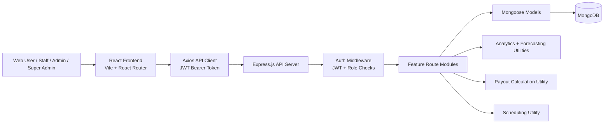
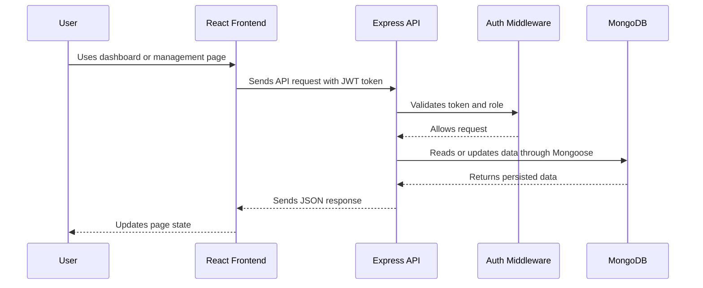
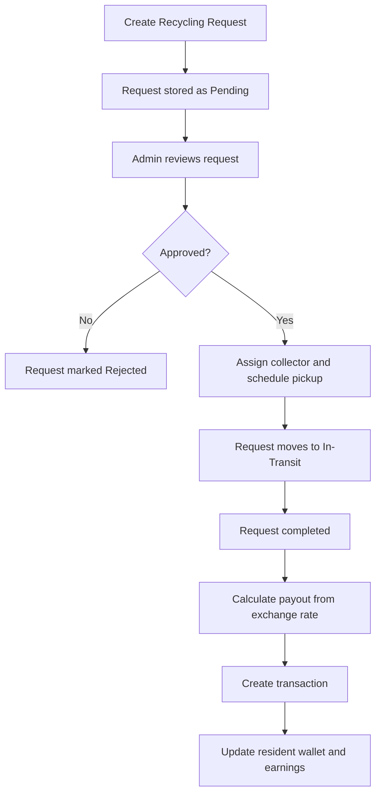
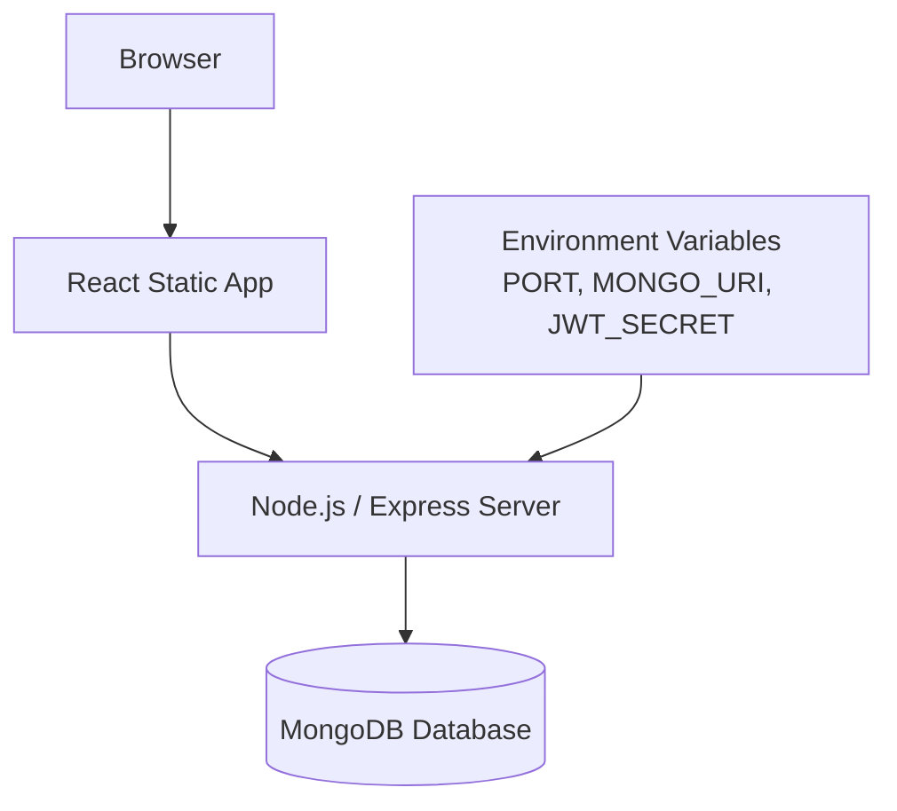

# RecyTech Simple System Architecture

## Overview

RecyTech is a web-based recycling management system with a React frontend, an Express.js REST API, and MongoDB for persistence. The system supports role-based access for Staff, Admin, Super Admin, and Collector users.



## Main Components

### 1. Frontend Application

Location: `recytechfrontend/src`

The frontend is a Vite React app. It uses React Router for page navigation and a shared Axios client for backend communication.

Key frontend parts:

- `App.jsx` defines public and protected routes.
- `api/client.js` configures the backend API URL and attaches the JWT token from `localStorage`.
- `ProtectedRoute.jsx` controls access to authenticated pages and role-specific pages.
- Page modules include dashboard, reports, requests, residents, collectors, users, education, exchange rates, transactions, and settings.

### 2. Backend API

Location: `server.js` and `recytechbackend/routes`

The backend is an Express.js server. It loads environment variables, connects to MongoDB, enables CORS, parses JSON requests, and mounts feature-specific API routes.

Main API groups:

- `/api/auth` - login, registration, forgot password, PIN verification, password reset
- `/api/users` - Super Admin user management
- `/api/requests` - recycling pickup/request management
- `/api/residents` - resident profile and wallet management
- `/api/collectors` - collector management
- `/api/transactions` - payout and transaction history
- `/api/exchange-rates` - waste-type payout rates
- `/api/education` - educational content management
- `/api/analytics` - dashboard reports, trends, summaries, predictive analytics
- `/api/scheduling` - forecasting, recommendations, assignment confirmation
- `/api/recycling-centers` - recycling center records

### 3. Authentication and Authorization

Location: `recytechbackend/middleware/authMiddleware.js`

Authentication uses JSON Web Tokens. After login, the frontend stores user information and the token in `localStorage`. Each API request sends the token as:

```text
Authorization: Bearer <token>
```

Backend authorization levels:

- `protect` verifies the JWT and loads the current user.
- `admin` allows Admin and Super Admin users.
- `superAdmin` allows only Super Admin users.

### 4. Database Layer

Location: `recytechbackend/models`

The backend uses Mongoose models to read and write MongoDB data.

Core collections:

- `User` - staff/admin/super admin/collector login accounts
- `Resident` - recycling residents, wallet balance, earnings, request count
- `Collector` - collector profile, linked user account, vehicle information
- `Request` - recycling request details, status, assigned collector, payout data
- `Transaction` - resident payments, refunds, adjustments
- `ExchangeRate` - active payout rates by waste type
- `Education` - articles, videos, PDFs, thumbnails, publication status

## Main Data Flow



## Example Business Flow: Recycling Request to Payout



## Deployment Shape



## Architecture Summary

RecyTech follows a simple three-layer architecture:

1. **Presentation layer** - React frontend pages and route protection.
2. **API/business layer** - Express route modules, authentication middleware, analytics, scheduling, and payout utilities.
3. **Data layer** - MongoDB accessed through Mongoose models.

This structure keeps the user interface, business rules, and database access separated while still being lightweight enough for a prototype.
